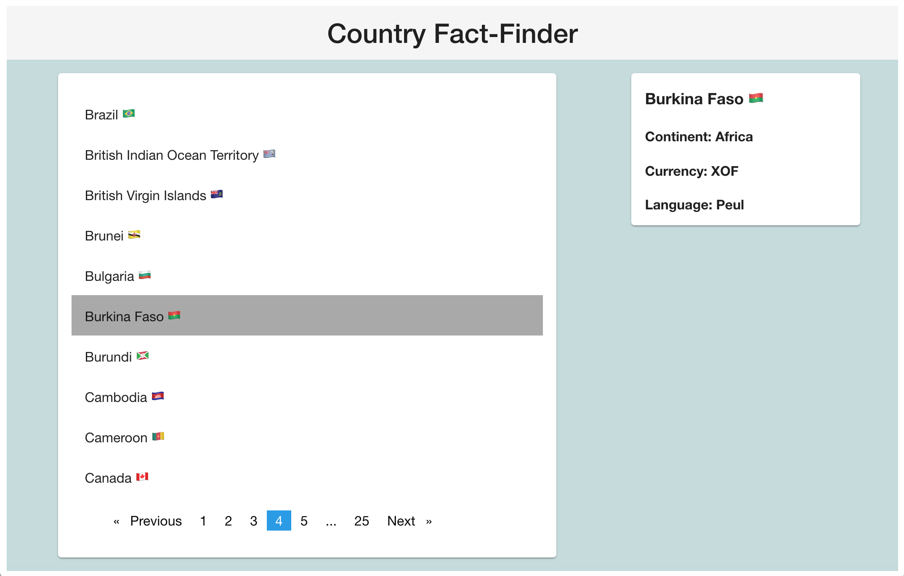

# Country Fact-Finder

This is a v basic app made with Angular and Graph QL. It queries this cheeky [GraphQL API](https://countries.trevorblades.com/) to get a list of countries. 
Clicking on a country displays some facts about it in a wee window. 
For styling I used the [Angular Material](https://material.angular.io/) framework and [NGX-Pagination](https://michaelbromley.github.io/ngx-pagination/#/).
 

## Running the App

Clone the repo and run `npm start' from the terminal. 
I might deploy the app at some point, but probably not.
